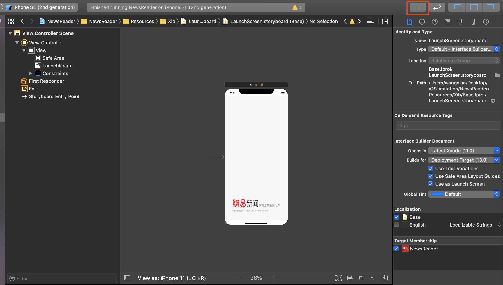
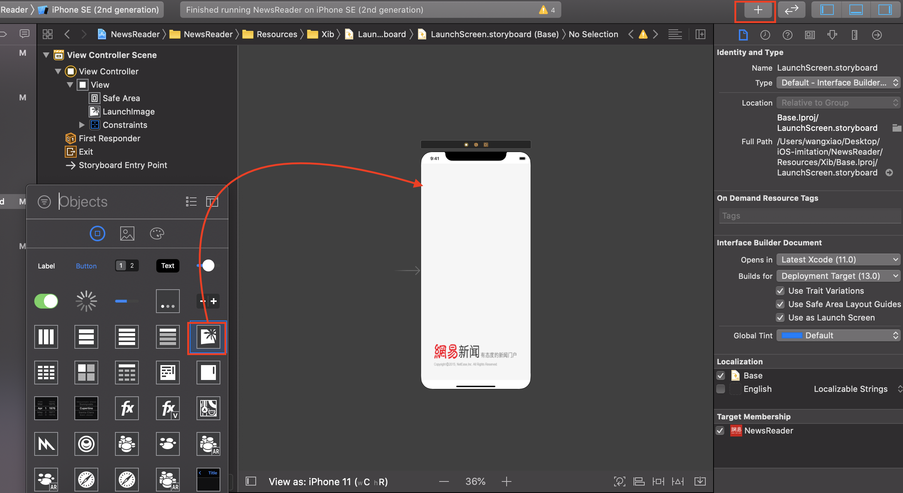
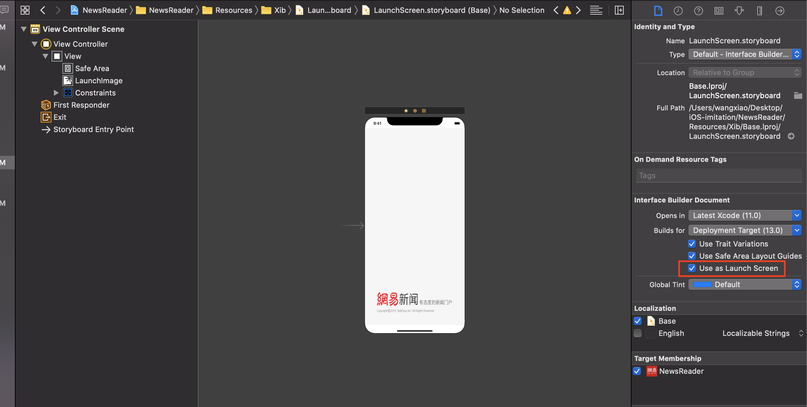
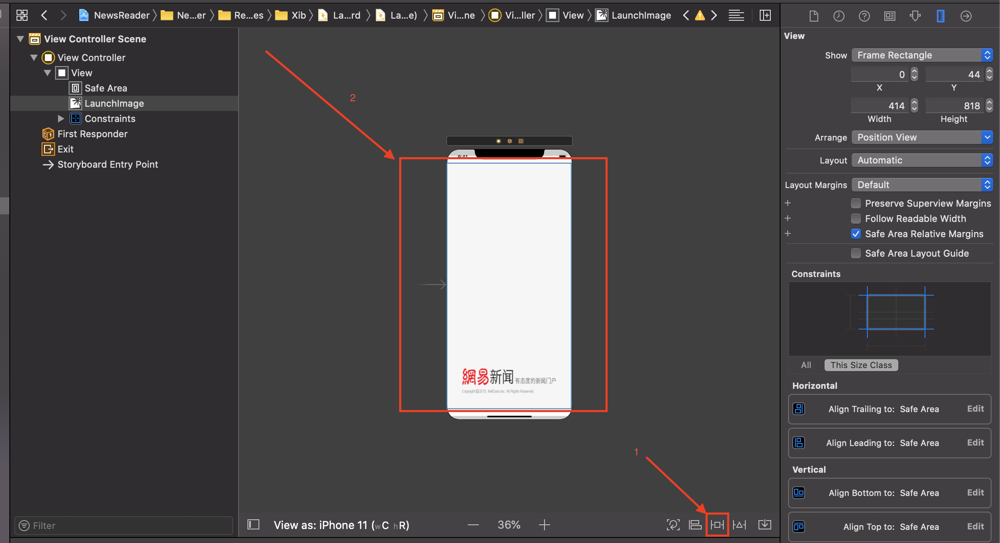
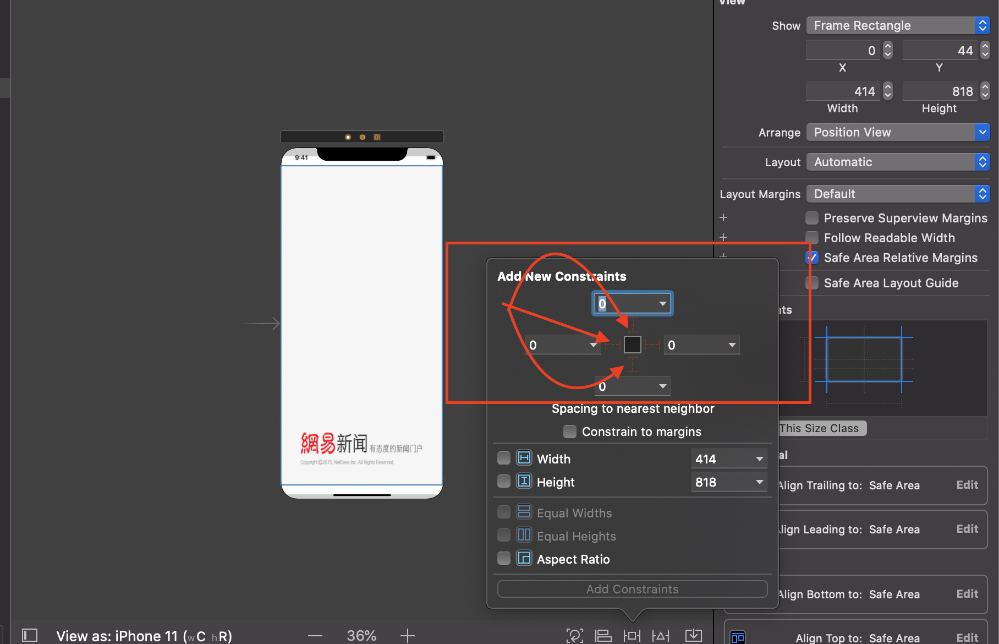
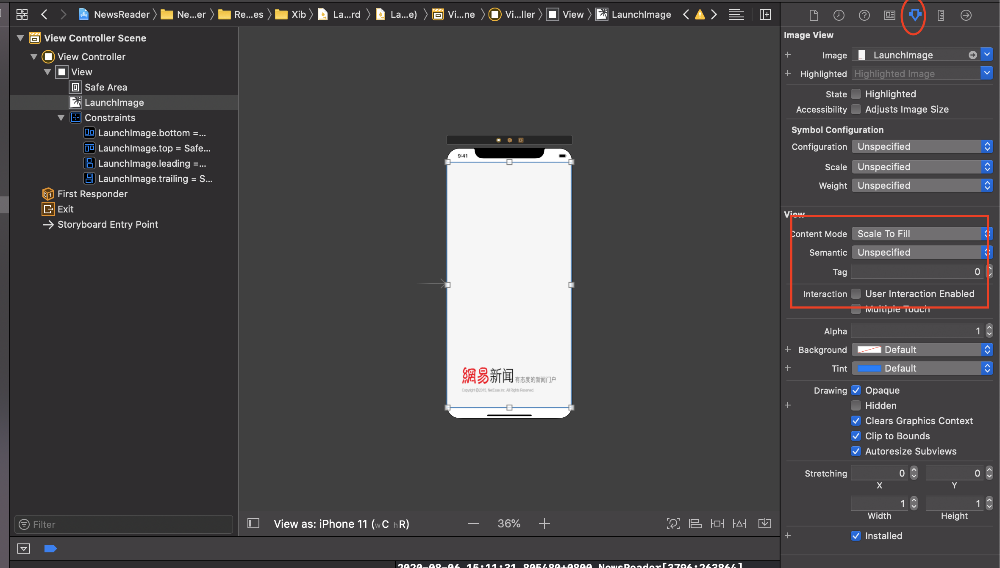

# iOS通过设置启屏页

1. 找到Assets.xcassets文件并往里面添加image图片
2. 找到LanuchScreen.storyboard文件
3. 点击"+"并添加一个imageView

4. 勾选'Use as Launch Screen'

5. 点击imageView并给imageView添加约束条件

6. 约束条件设置 点击红色框内线条

再点击 “add 4 constraints”然后全部设置为0

7. 设置填充方式

