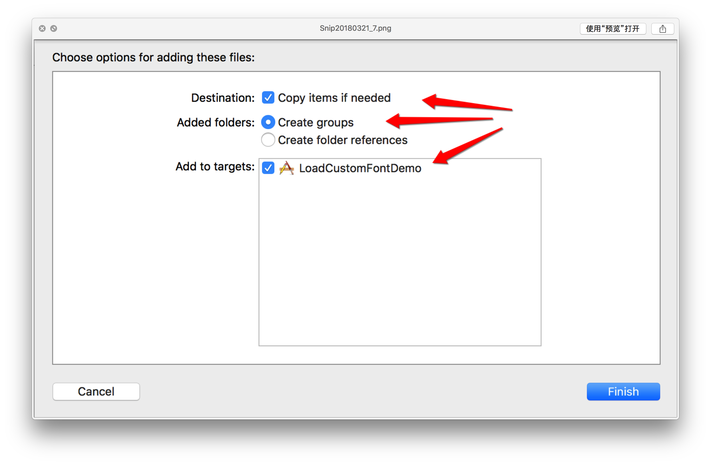
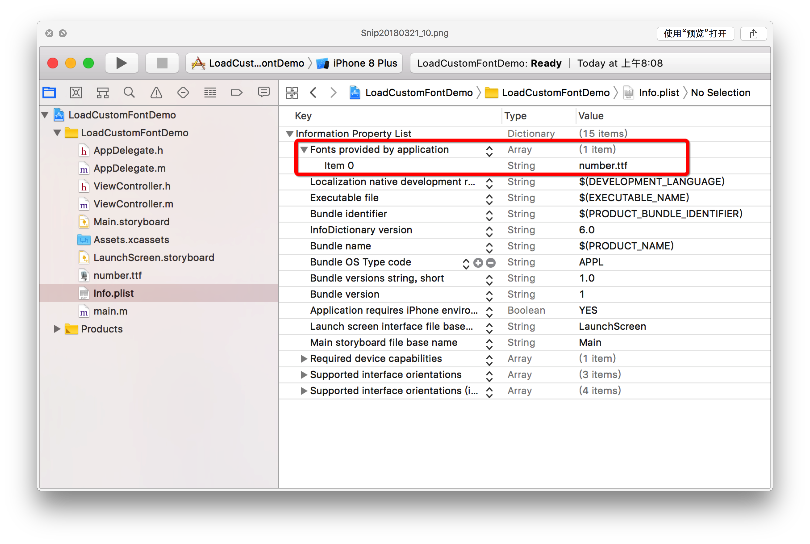
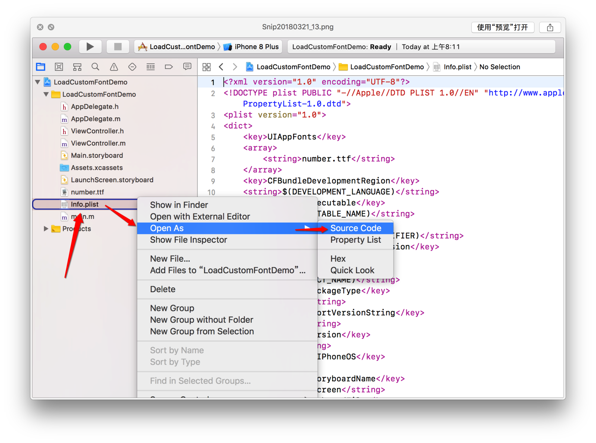
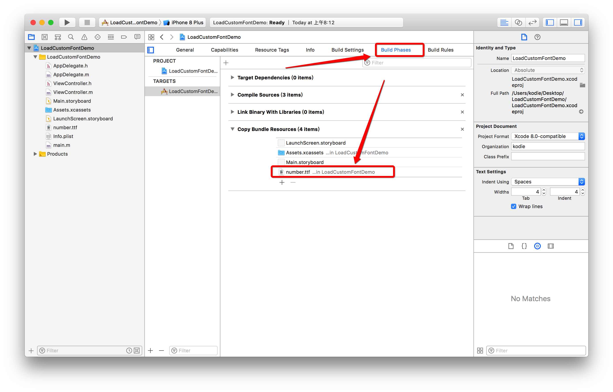

# iOS设置自定义字体

1. 下载所需要的TTF字体文件。
2. 导入到工程中，在Info.plist中添加一项：Fonts provided by application,填写整个文件名包括后缀.





或者通过源码的方式添加：



``` objective-c
<key>UIAppFonts</key>
<array>
	<string>number.ttf</string>
</array>
```

3. 确保资源文件中有添加此字体文件，一般拖进来就会默认添加的，但是最好确保下，有时候可能因为XCode的原因未及时添加进resource,截图如下



4. 按照以上操作，在objective-c文件中使用"number.ttf"即可使用自定义字体。